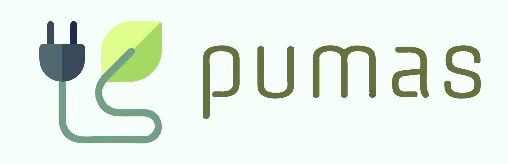
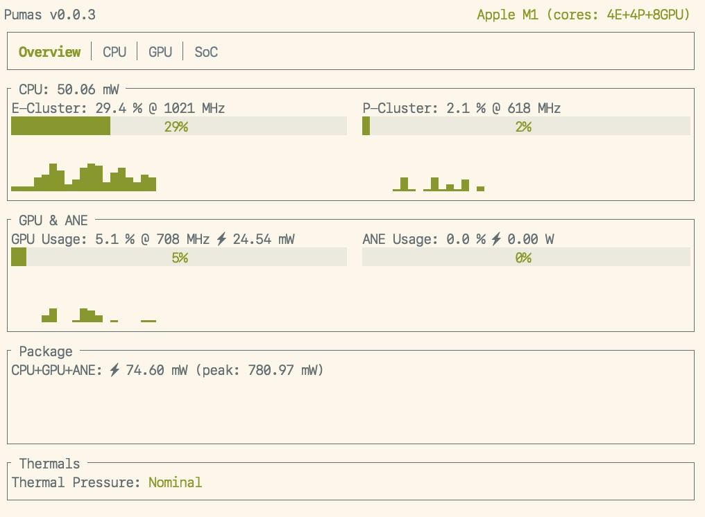

# `pumas`

[](https://crates.io/crates/pumas)
[](https://docs.rs/pumas)
[](https://rust-lang.github.io/rfcs/2495-min-rust-version.html)
[](https://doc.rust-lang.org/edition-guide/rust-2021/index.html)
[](https://github.com/graelo/pumas/actions/workflows/essentials.yml)



<!-- cargo-sync-readme start -->

A nvtop-inspired command line tool for Apple Silicon Macs: aka M1, M2, ... This is basically a
reimplemented version of [asitop] in Rust.

| Type        | Metrics                      | Available | Comments                                                  |
| ---         | ---                          | ---       | ---                                                       |
| Utilization | CPU Clusters, GPU, ANE       | ✅        | History & current values. ANE util. is measured via power |
| Power       | CPU, GPU, ANE, total package | ✅        | History & current values                                  |
| Frequency   | CPU Clusters, GPU            | ✅        | Current avg. values                                       |
| Frequency   | CPU Clusters, GPU            | planned   | Residency distrib. histograms                             |
| Memory      | RAM & swap: size and usage   | planned   | Apple removed memory bandwidth from powermetrics.         |

Pumas uses the built-in `powermetrics` utility on macOS, which allows access to a
variety of hardware performance counters. Note that it requires `sudo` to run due
to `powermetrics` needing root access to run. Pumas is lightweight and has
minimal performance impact.

Pumas only works on Apple Silicon Macs on macOS Monterey and later.

This is a work in progress.

## Installation

```sh
cargo install pumas
brew install graelo/tap/pumas
```

## Quickstart

```sh
sudo pumas run
```



## Usage

```sh
$ pumas --help
A power usage monitor for Apple Silicon.

Usage: pumas <COMMAND>

Commands:
  run                  Run the power usage monitor
  generate-completion  Print a shell completion script to stdout
  help                 Print this message or the help of the given subcommand(s)

Options:
  -h, --help     Print help
  -V, --version  Print version
```

and

```sh
$ pumas run --help
Run the power usage monitor

Usage: pumas run [OPTIONS]

Options:
  -i, --sample-rate <SAMPLE_RATE_MS>     Update rate (milliseconds): min: 100 [default: 1000]
      --accent-color <ACCENT_COLOR>      Accent color: ASCII code in 0~255 [default: 2]
      --gauge-bg-color <GAUGE_BG_COLOR>  Gauge background color: ASCII code in 0~255 [default: 7]
  -h, --help                             Print help (see more with '--help')
  -V, --version                          Print version
```

## Details

`powermetrics` is used to measure the following:

 - ❌ CPU usage via `powermetrics` (removed: incorrect on M2)
- GPU utilization via active residency
- CPU & GPU frequency
- Package/CPU/GPU/ANE energy consumption

`sysinfo` crate is used to measure the following:

- per-cluster CPU utilization
- per-core CPU utilization (planned)

`sysctl` is used to measure the following:

- CPU name
- CPU core counts

`system_profiler` is used to measure the following:

- GPU core count

Some information is guesstimate and hardcoded as there doesn't seem to be a official source for
it on the system:

- CPU, GPU & ANE max power draw

## License

Licensed under the [MIT License].

### Contribution

Unless you explicitly state otherwise, any contribution intentionally submitted
for inclusion in the work by you, as defined in the MIT license, shall
be licensed as MIT, without any additional terms or conditions.

[MIT license]: http://opensource.org/licenses/MIT
[asitop]: https://github.com/tlkh/asitop

<!-- cargo-sync-readme end -->
