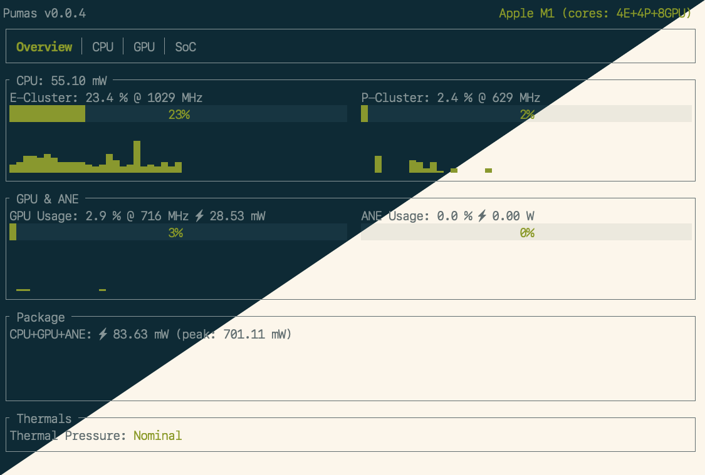

# `pumas`

<!-- cargo-sync-readme start -->

A power usage monitor for Apple Silicon.

Version requirement: _rustc 1.64+_

## Features

TODO

## License

Licensed under the [MIT License].

### Contribution

Unless you explicitly state otherwise, any contribution intentionally submitted
for inclusion in the work by you, as defined in the MIT license, shall
be licensed as MIT, without any additional terms or conditions.

[MIT license]: http://opensource.org/licenses/MIT

<!-- cargo-sync-readme end -->
