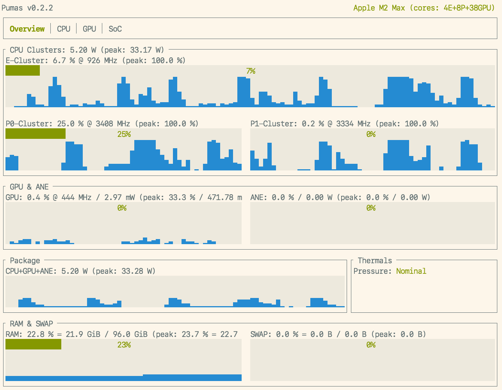

# `pumas`

[](https://crates.io/crates/pumas)
[](https://docs.rs/pumas)
[](https://rust-lang.github.io/rfcs/2495-min-rust-version.html)
[](https://doc.rust-lang.org/edition-guide/rust-2021/index.html)
<!-- [](https://github.com/graelo/pumas/actions/workflows/essentials.yml) -->


<!-- cargo-sync-readme start -->

A nvtop-inspired command line tool for Apple Silicon Macs: aka M1, M2, ... This is basically a
reimplemented version of [asitop] in Rust.

| Type        | Metrics                      | Available | Comments                                                  |
| ---         | ---                          | ---       | ---                                                       |
| Utilization | CPU Clusters, GPU, ANE       | ✓         | History & current values. ANE util. is measured via power |
| Power       | CPU, GPU, ANE, total package | ✓         | History & current values                                  |
| Frequency   | CPU Clusters, GPU            | ✓         | Current avg. values                                       |
| Frequency   | CPU Clusters, GPU            | planned   | Residency distrib. histograms                             |
| Memory      | RAM & Swap: size and usage   | ✓         | Apple removed memory bandwidth from powermetrics.         |

To gather data, Pumas uses both the macOS built-in `powermetrics` utility, and the `sysinfo`
crate (same data as `htop`).

The built-in `powermetrics` allows access to a variety of hardware performance counters. Note
that Pumas requires `sudo` to run only due to `powermetrics` needing root access to run.

Pumas is lightweight and has minimal performance impact.

## Installation

```sh
brew install graelo/tap/pumas
```

or

```sh
cargo install pumas
```

or

```sh
x install pumas
```

## Quickstart

```sh
sudo pumas run
```

Use the arrow keys to switch between tabs. Press `Esc`, `q` or `x` to quit.

### Screenshots

Overview Tab: global metrics for utilization and power consumption.




CPU Tab: per-cluster CPU utilization (with short history) and frequency
(with short history)


GPU Tab: GPU utilization (with short history) and frequency
(with short history)


SoC Tab: misc info about the SoC


Startup:


## Usage

```sh
$ pumas --help
A power usage monitor for Apple Silicon.

Usage: pumas <COMMAND>

Commands:
  run                  Run the power usage monitor
  generate-completion  Print a shell completion script to stdout
  help                 Print this message or the help of the given subcommand(s)

Options:
  -h, --help     Print help
  -V, --version  Print version
```

Pumas can run in two modes: UI mode (the default) and JSON mode.

```sh
$ pumas run --help
Run the power usage monitor

Usage: pumas run [OPTIONS]

Options:
  -i, --sample-rate <SAMPLE_RATE_MS>
          Update rate (milliseconds): min: 100 [default: 1000]
      --history-size <HISTORY_SIZE>
          History buffer size: default: 128 [default: 128]
      --accent-color <ACCENT_COLOR>
          Accent color for labels: ASCII code in 0~255, default: green [default: 2]
      --gauge-fg-color <GAUGE_FG_COLOR>
          Gauge foreground color: ASCII code in 0~255, default: green [default: 2]
      --gauge-bg-color <GAUGE_BG_COLOR>
          Gauge background color: ASCII code in 0~255, default: white [default: 7]
      --history-fg-color <HISTORY_FG_COLOR>
          History foreground color: ASCII code in 0~255, default: blue [default: 4]
      --history-bg-color <HISTORY_BG_COLOR>
          History background color: ASCII code in 0~255, default: white [default: 7]
      --json
          Print metrics to stdout as JSON instead of running the UI
  -h, --help
          Print help (see more with '--help')
  -V, --version
          Print version
```

### JSON Mode

In JSON mode, Pumas will stream metrics to stdout as JSON instead of running the UI. You can
then pipe the metrics to `jq`, or create a node-exporter for Prometheus, etc.

For instance, the following command will stream the active ratio of the third CPU core of the
first CPU cluster at each sample interval:

```sh
$ sudo pumas run --json | jq '.metrics.e_clusters[0].cpus[2].active_ratio'
0.04624276980757713
0.11764705926179886
^C
```

The JSON schema and an example are available in the [schema](./schema) directory.

### Quick Launch

Some users reported they want a shorter way to launch Pumas. A quick way to do that is to
give your user the ability to sudo run without password the `pumas` command (and only that
command, for security reasons).

To achieve this, let's create a "drop-in" file `/etc/sudoers.d/pumas`

```sh
sudo visudo -f /etc/sudoers.d/pumas
```

Add the following line to the file, replacing `username` with your username:

```sudoers
username ALL=(ALL) NOPASSWD: /opt/homebrew/bin/pumas
```

If you later remove `pumas`, you just have to delete this file. It's not a great practice to
modify `/etc/sudoers` directly.

Now you can run `sudo pumas run` without being asked your password. You're free to add an alias
to your shell, such as

```sh
alias pumas='sudo pumas run'
```

Thanks to user @woshiniming007 for the suggestion!

#### Security considerations

- You should limit the commands you allow to run without password to the minimum necessary.
- You should use a drop-in file to avoid modifying `/etc/sudoers` directly.

## Source of metrics

`sysinfo` crate is used to measure the following:

- per-cluster CPU utilization
- per-core CPU utilization
- RAM & Swap usage & size

`powermetrics` is used to measure the following:

- ~~CPU usage via `powermetrics`~~ (removed: incorrect on M2 chips)
- GPU utilization via active residency
- CPU & GPU frequency
- Package/CPU/GPU/ANE energy consumption

`sysctl` is used to measure the following:

- CPU name
- CPU core counts

`system_profiler` is used to measure the following:

- GPU core count

Some information is guesstimate and hardcoded as there doesn't seem to be a official source for
it on the system:

- CPU, GPU & ANE max power draw

## License

Licensed under the [MIT License].

### Contribution

Unless you explicitly state otherwise, any contribution intentionally submitted
for inclusion in the work by you, as defined in the MIT license, shall
be licensed as MIT, without any additional terms or conditions.

[MIT license]: http://opensource.org/licenses/MIT
[asitop]: https://github.com/tlkh/asitop

<!-- cargo-sync-readme end -->
